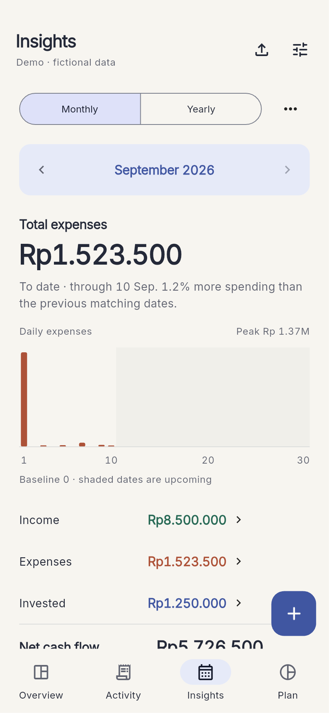
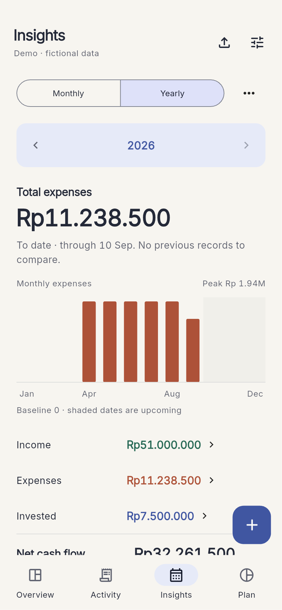

# Luma Ledger

A daily expense tracker for Android and iOS, built with Flutter, GetX and local SQLite. A macOS runner is included for development. There is no server, account, advertising, or analytics.

## Version 1.2: Pocket almanac

A phone-first calendar view of your money: warm surfaces, indigo period controls, clear financial rows, and a rust-colored spending chart. Android uses a Material navigation bar and Add action on phones, with a navigation rail on wider screens. The wallet-and-coin launcher icon is documented in `docs/BRANDING.md`.

**Insights → Monthly / Yearly** shows every day or all twelve months, calendar-aligned comparisons, exact income/expense/investment/net totals, category shares, spending averages, and wallet and weekday breakdowns. Open **Monthly breakdown**, tap a month, then open **Daily breakdown** and tap a day to inspect its expenses. The statistics selection survives a visit to Activity. The menu beside the Monthly/Yearly control preserves all-time and custom-date reports.

See `docs/STATISTICS.md` for definitions and `DESIGN.md` for the implemented design system.

| Monthly report | Yearly report |
| --- | --- |
|  |  |

Native Android captures with fictional demo data. More captures and reproduction notes are in [docs/screenshots](docs/screenshots/README.md).

## Run

```sh
cd /Users/cmt/development/project_flutter/luma_ledger
flutter pub get
flutter run
```

Built and verified using Flutter 3.35.6 / Dart 3.9.2. Dependencies are pinned in the committed `pubspec.lock`. Android and iOS native projects are included; this is not a web application.

On first launch, create a ledger. IDR is the default. You can also explore an explicitly labeled demo with fictional data. The distributed app contains no personal transaction history.

## Daily use

- Add, edit, duplicate and delete expenses, income, investments and wallet transfers. Deleted transactions have an immediate Undo action.
- Record dates, categories, source/destination wallets and notes. Future dates are scheduled and excluded from actuals until their date.
- Search descriptions and notes; filter by date range, type, category, wallet and review status.
- View income, everyday spending, investment contributions and net cash flow for a month, year, all history or custom dates.
- Review daily spending for a month and monthly spending for a year, including exact totals, category ranking and shares, wallet spending, descriptions/merchants, weekday patterns, and calendar-aligned comparisons. All-time/custom reports retain the six-month cash-flow view.
- Set a total or category monthly budget; see spending, remaining funds and overspend.
- Schedule weekly/monthly/yearly recurring expenses, income and investments. Review and record due occurrences, or skip one. No background notifications or automatic posting are currently implemented.
- Add wallets with opening balances. Transfers preserve the overall ledger balance.
- Create separate ledgers for personal, household or other purposes. Each ledger has one fixed currency: IDR, USD, EUR, SGD or AUD. This is local data separation, not password-protected multi-user authentication.
- Choose light, dark or system appearance. Native fields and buttons support touch, focus and system text scaling.

## Import your existing CSV

1. Create your personal IDR ledger.
2. Tap the import icon or **Settings → Import CSV**.
3. Choose the wallet for your historical records.
4. Select `expenses_20260905_111423.csv` using the platform file picker.
5. Review record counts, warnings and any row errors, then tap **Import**.
6. Open Activity, choose **All time**, and review records marked **Needs review**.

The importer accepts UTF-8 CSV with `date,amount,description,category,isIncome,isBalanceForward` and optional `note`. Dates use `YYYY-MM-DD`; amounts use a decimal point without grouping separators. Quoted commas, quoted multiline notes, UTF-8 BOM and CRLF are supported. A file with invalid rows is blocked until corrected. Imports run in one SQL transaction.

**Accounting rules from the supplied export:**

- `isBalanceForward=true` overrides `isIncome=true`. These are historical snapshots, excluded from income, cash flow and wallet balances.
- `investment` outflows become investment contributions, separate from everyday spending.
- Category case is normalized (`Food` and `food` share a category).
- Non-snapshot `balance` expenses remain expenses and are flagged for review. They are not automatically converted to transfers because the source does not identify a destination wallet.
- No exchange rate or currency is inferred from the CSV. Amounts use the destination ledger's currency.

Repeated imports use a normalized content fingerprint plus occurrence number. The same file can be imported safely again; identical repeated rows within a file remain separate transactions. Editing an old source row produces a new fingerprint and may add a new transaction. Importing a subset of identical repeated rows cannot identify which occurrence was intended. Inspect the preview and use a full JSON backup for device migration.

## Reports and balances

Money is stored as integers at 100 internal units per currency unit; arithmetic does not use floating-point amounts. Percentages are calculated from integer totals.

- **Everyday spending:** expense records only.
- **Investment:** contributions/outflows, not valuation or investment returns.
- **Net cash flow:** income − expenses − investments.
- **Cash retained:** net cash flow ÷ income; undefined when there is no income, possibly negative.
- **Recorded balance:** wallet opening balances + income − expenses − investments, with transfers affecting the respective wallets and snapshots ignored.
- **Daily average:** expenses ÷ elapsed calendar days in the selected period, including days without entries.
- **Monthly/yearly comparison:** preceding calendar month or year. An incomplete period compares matching calendar dates, capped at the last available day. Missing records and zero spending baselines are labeled. All-time/custom reports use the preceding range of the same number of days and suppress full-period percentages for incomplete ranges.
- **Six-month chart:** ends at the selected period's end, capped at today. Zero-height months mean no recorded activity, not proof of zero real-world spending.

Historical CSV data may not cover every transaction. A recorded balance is not a verified bank balance. Set an opening balance only for money held before the first recorded transaction; do not also add monthly carry-forwards.

## Backup and sharing

Use **Settings → Export & backup → Complete backup** to save a JSON containing every ledger, wallet, category, transaction, budget, schedule and theme setting. Use **Restore a JSON backup** on another installation. Restore asks before replacing all existing local data, validates relationships, and rolls back on failure.

CSV exports are for analysis; JSON is the full-fidelity migration format. Transfers and wallet relationships are restored only through JSON. Spreadsheet-sensitive text is escaped in CSV. There is no automatic cloud sync, encryption, attachment storage, app lock, bank connection or remote multi-user sharing.

Share the installation package with someone else; they create their own ledger on their own device. Share a backup only if you intentionally want to give them its financial data. Database files and backups are not bundled into builds.

See [Distribution](docs/DISTRIBUTION.md), [Architecture](docs/ARCHITECTURE.md), [Privacy](docs/PRIVACY.md), and [Verification](docs/VERIFICATION.md).

## Development checks

```sh
flutter analyze
flutter test
# Optional private migration verification; source stays outside the repository:
LUMA_TEST_CSV=/path/to/expenses.csv flutter test .private_tests/source_csv_test.dart
flutter test integration_test/app_test.dart -d <ios-simulator-device-id>
```

The optional `.private_tests` directory is local-only and excluded from distributed source.

The integration suite uses an isolated test database, verifies real SQLite transactions and persistence, and exercises transaction entry plus year → month → day drill-down. It generates fictional demo screen captures inside the test app's documents directory.

Reference implementation guidance: [Flutter SQLite cookbook](https://docs.flutter.dev/cookbook/persistence/sqlite), [GetX](https://pub.dev/packages/get), [sqflite](https://pub.dev/packages/sqflite). Version 1.2 uses the Impeccable skill and the user-selected Pocket almanac direction, implemented directly in native Flutter.
